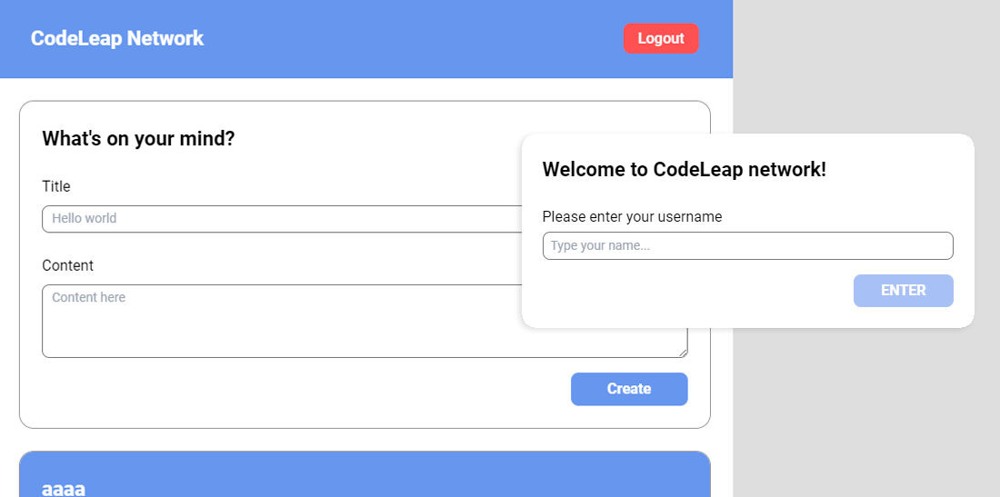

# CodeLeap Network

  

## 🚀 Technologies Used

- Vite
- ReactJS
- React Router Dom
- Redux
- Axios
- Date-fns
- RadixUI

## ⚙️ Installation

### Clone project

git clone https://github.com/ViniGSouza/code-leap-network.git

### Install the dependencies by typing in the terminal

yarn

### Run the application

yarn dev

---

Developed by me.
